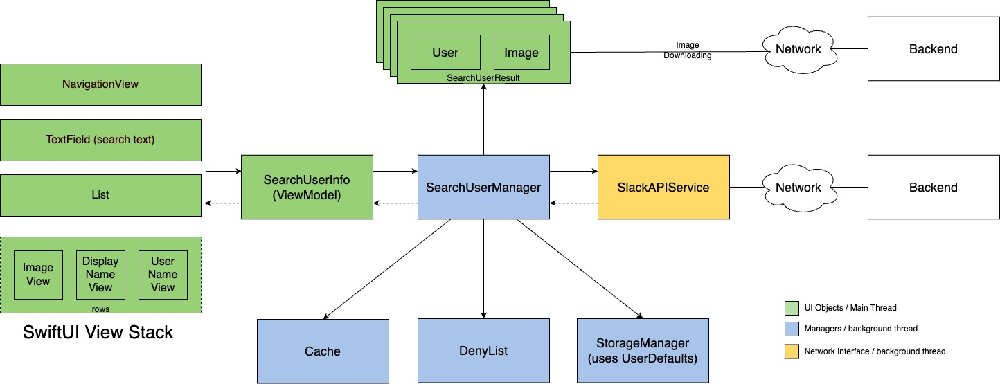

# SearchUser iOS App

- iOS 17.4 (Tested on Simulator)
- Xcode 15 (Built and tested with Xcode 15.3)

## Design

1. As described in the diagram below the UI is constructed using `SwiftUI`, and The `SearchUserManager` is the central component in the app. When a user enters a text in the search text box, via the binded property searchText in the SearchUserInfo, initiates a task and requests `SearchUserManager` for the list of users to show.
2. The `SearchUserManager` checks (a) if the request is already found in cache or (b) text is in the deny list or (c) empty. If not, then the `SearchUserManager` initiates network request to fetch users from backend using `SlackAPIService`. 
3. Once the response is received, the reponse is parsed and usrs are stored in the User list on main thread.
4. The Users property is observed by `SwiftUI`, hence UI gets updated based on the response.
5. The response istored in persistent storage and cache for future uses.
6. The UI is designed per [specs](./docs/UISpecs.pdf).

  </img>

## Offline mode & storage

The App uses UserDefaults as persistent storage to support offline mode. The StorageManager 
The`StorageManager` saves following in UserDefaults and retrives when offline mode is detected

-  `{ "Users" : [{ "id" : <int>, "display_name":  <String>, username: <String> }, ..] }`
-  `{ "Avatars":  [{"id" : "Data (image)"}, ..] }`
-  `{"Searches: { <string> : [id1, id2...]} }`

## Performance and memory footprint

| Type      | Measurement |
| ----------- | ----------- |
| CPU      | 0 - 15 %       |
| Memory   | 42MB        |
| Disk | 44 Kb/S |
| Launch Time | TODO | 

## Security

- User is not authenticated
- HTTPS is used
- Future enhancments: Encriptypt data before storing to disk

## Assumptions

- If the backend returns empty list, I am updating the denylist in memory but not updating the or using persistent storage, this is mainly to support admin adding new user in the backend. Ideally denylist should be received from backend to support the admin add/removing users in the backend though.

## Tests

- Unit tests added for SearchUserManager for demo purpose only (see Next Steps / Future Enhancements).

## Logging

- At present the app is using iOS default print statements at few places for debuggin purpose (see Next Steps / Future Enhancements) 

## Next Steps / Future Enhancements : 
- Define error codes and perform error handlings
- UI Betterments: animations and polished components
- More tests coverage: Unit tests, integration tests, end-to-end tests on CI and device farms
- Profiling and performance measurements
- Better logging and user action reporting to backend

